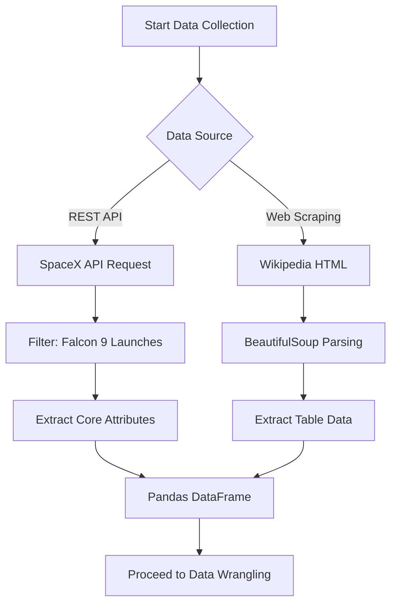
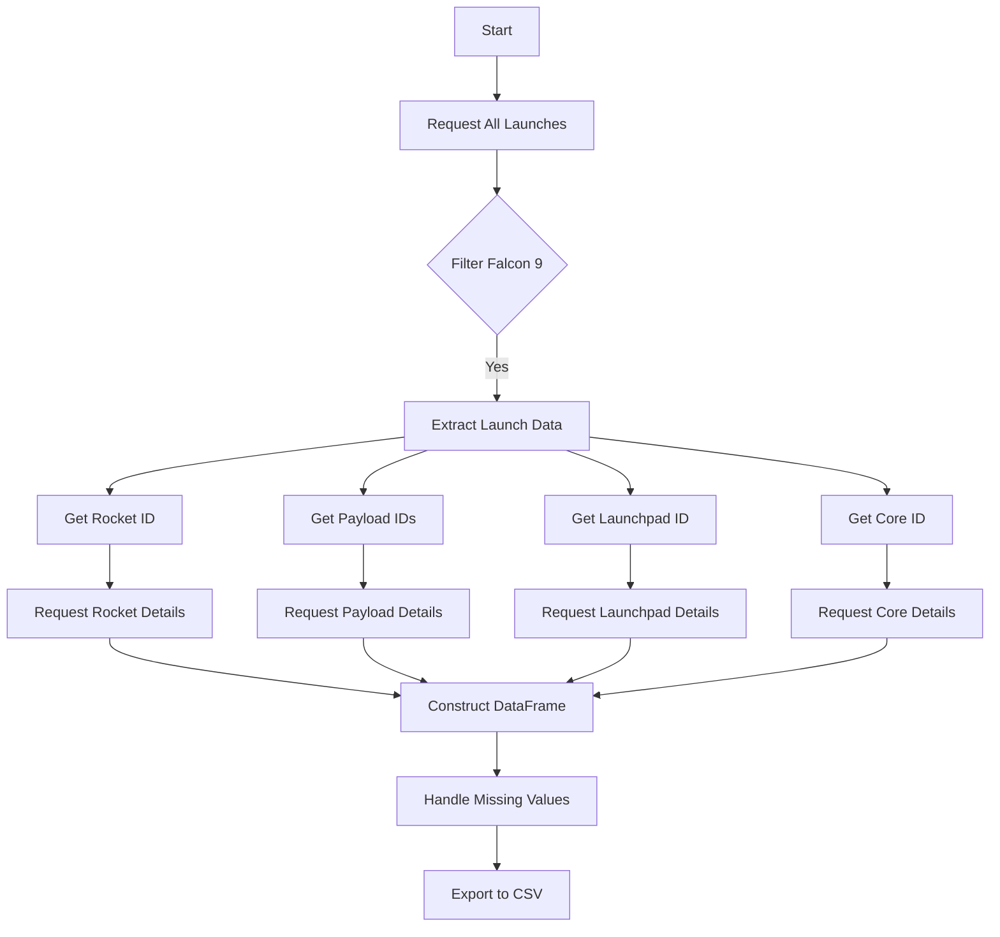
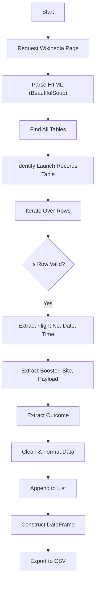
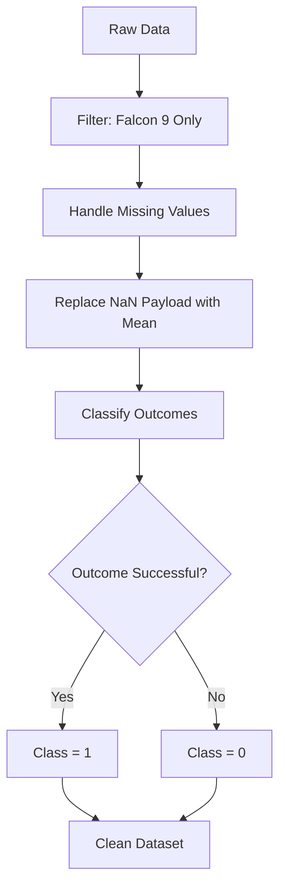

# IBM Applied Data Science Capstone: SpaceX Falcon 9 Landing Prediction

## Project Overview
The commercial space industry is rapidly evolving, with SpaceX leading the charge by making space travel more affordable. The main goal of this project is to predict if the Falcon 9 first stage will land successfully. This insight helps estimate launch costs, giving competitors and stakeholders a strategic edge.

This repository contains the complete analysis, including data collection, wrangling, exploratory data analysis (EDA), visualization, and machine learning models.

# Executive Summary
## Summary of methodologies
We utilized a multi-faceted data science methodology:
1.  **Data Collection**: Gathered data via the SpaceX REST API and web scraping from Wikipedia.
2.  **Data Wrangling**: Cleaned and processed data using Pandas, handling missing values and creating classification labels.
3.  **Exploratory Data Analysis (EDA)**: Used SQL for querying databases and Matplotlib/Seaborn for visualizing trends and correlations.
4.  **Interactive Visual Analytics**: Developed geospatial maps using Folium and a dynamic dashboard using Plotly Dash.
5.  **Predictive Analysis**: Built and tuned classification models (Logistic Regression, SVM, Decision Tree, KNN) to predict landing outcomes.

## Summary of all results
-   **Launch Success**: Success rates have significantly improved over time. Sites like **KSC LC-39A** show superior performance.
-   **Orbits**: Orbits such as **ES-L1, GEO, HEO, and SSO** achieved a 100% success rate.
-   **Payload**: Lighter payloads generally have higher success rates, though successful landings exist across various payload ranges.
-   **Model Performance**: Classification models achieved an accuracy of approximately **83.33%**, with the Decision Tree model performing consistently well on test data.

# Introduction
## Project background and context
The commercial space industry is rapidly evolving, with SpaceX leading the charge by making space travel more affordable. SpaceX advertises Falcon 9 rocket launches on its website with a cost of 62 million dollars; other providers cost upward of 165 million dollars each, much of the savings is because SpaceX can reuse the first stage.

## Problems you want to find answers
The primary objective of this project is to predict whether the first stage of the Falcon 9 rocket will land successfully. By determining the landing outcome, we can estimate the cost of a launch. This information is valuable for competitors or stakeholders looking to bid against SpaceX for rocket launches.

# Methodology
-   **Data Collection**: Gathering raw data from APIs and web sources.
-   **Data Wrangling**: Cleaning and standardizing the data for analysis.
-   **Exploratory Data Analysis (EDA)**: Understanding data distribution and relationships using SQL and visualizations.
-   **Interactive Visual Analytics**: Creating maps and dashboards for dynamic exploration.
-   **Predictive Analysis**: Building machine learning models to classify landing outcomes.

## Data Collection
-   **Methodology**: we employed a dual-source strategy to compile a comprehensive dataset:
    1.  **Direct API Consumption**: Leveraged the SpaceX REST API to acquire structured launch data.
    2.  **Web Scraping**: Utilized **BeautifulSoup** to scrape historical launch records from Wikipedia for supplementary context.

-   **Data Collection Process Flow**:


## Data Collection – SpaceX API
-   **Process**: We used the SpaceX REST API (`https://api.spacexdata.com/v4/launches/past`) to retrieve historical launch data.
-   **Details**: Requests were filtered for Falcon 9 launches. We extracted core attributes including Booster Version, Payload Mass, Orbit, Launch Site, and Landing Outcome.
-   The JSON responses were parsed and normalized into a Pandas DataFrame.

-   **Notebook**: [SpaceX API Data Collection](./jupyter-labs-spacex-data-collection-api.ipynb)

    **SpaceX API Data Collection Flow**:


## Data Collection - Scraping
-   **Process**: We utilized **BeautifulSoup** to scrape additional Falcon 9 launch records from Wikipedia.
-   **Details**: Static HTML tables were parsed to extract data such as Flight No, Date, Time, Version Booster, Launch Site, Payload, and Mission Outcome.
-   This data was used to cross-reference and supplement the API dataset.

-   **Notebook**: [Web Scraping Data Collection](./jupyter_labs_webscraping_(1).ipynb)

-   **Web Scraping Process Flow**:


## Data Wrangling
-   **Filtering**: We filtered the dataset to include only Falcon 9 launches.
-   **Missing Values**: Missing values in the `PayloadMass` column were replaced with the mean payload mass.
-   **Outcome Classification**: We created a binary `Class` column:
    -   **1 (Success)**: Outcomes like 'True Ocean', 'True RTLS', 'True ASDS'.
    -   **0 (Failure)**: Outcomes like 'False Ocean', 'False RTLS', 'False ASDS', 'None ASDS', 'None None'.

-   **Notebook**: [Data Wrangling](./labs-jupyter-spacex-Data%20wrangling.ipynb)

-   **Wrangling Process Flow**:


## EDA with Data Visualization
- Perform exploratory data analysis (EDA) using visualization and SQL
- Perform interactive visual analytics using Folium and Plotly Dash
-   **Notebooks**:
    -   [EDA with Visualization](./jupyter-labs-eda-dataviz-v2.ipynb)

## EDA with SQL
-   **Key Queries**:
    -   Calculated total payload mass carried by NASA boosters.
    -   Identified average payload mass for booster version F9 v1.1.
    -   Determined success rates for different landing outcomes.
    -   Ranked count of landing outcomes between specific dates.
-   **Notebook**: [EDA with SQL](./jupyter-labs-eda-sql-coursera_sqllite.ipynb)

## Build an Interactive Map with Folium
-   **Map Objects**: Created markers for each launch site (CCAFS SLC-40, KSC LC-39A, VAFB SLC-4E).
-   **Color Coding**: Used green markers for successful landings and red markers for failed landings.
-   **Proximities**: Added circles and lines to visualize distances from launch sites to nearest coastlines, railways, and highways, assessing safety zones.
-   **Notebook**: [Launch Site Location (Folium)](./lab-jupyter-launch-site-location-v2.ipynb)

# Build an Interactive Dashboard with Plotly Dash
-   **Components**: Included a Dropdown menu for selecting Launch Sites and a Range Slider for Payload Mass (0kg - 10,000kg).
-   **Visualizations**:
    -   **Pie Chart**: Shows the percentage of successful launches for all sites or a specific site.
    -   **Scatter Plot**: Displays correlation between Payload Mass and Launch Outcome (Success/Failure) for selected sites.
-   **Reference**: [Plotly Dash Instructions/Output](./Plotly_dash_task.pdf)
-   **App Script**: [SpaceX Dash App](./spacex_dash_app.py)

# Predictive Analysis (Classification)
-   **Process**:
    -   Standardized the dataset.
    -   Split data into **Training (80%)** and **Testing (20%)** sets.
    -   Used **GridSearchCV** with 10-fold cross-validation to tune hyperparameters.
-   **Models Built**: Logistic Regression, Support Vector Machine (SVM), Decision Tree, K-Nearest Neighbors (KNN).
-   **Best Model**: All models performed similarly with an accuracy of **~83.33%** on the test set. The Decision Tree model is often highlighted for its interpretability.

-   **Notebook**: [Machine Learning Prediction](./SpaceX-Machine-Learning-Prediction-Part-5-v1.ipynb)

-   **Prediction Methodology Flow**:
```mermaid
graph TD
    A[Clean Dataset] --> B[Standardize Features];
    B --> C[Train/Test Split (80/20)];
    C --> D[Model Selection];
    D --> E[Logistic Regression];
    D --> F[SVM];
    D --> G[Decision Tree];
    D --> H[KNN];
    E & F & G & H --> I[Hyperparameter Tuning (GridSearchCV)];
    I --> J[Evaluate Accuracy];
    J --> K[Best Model Selection];
```

# Results
- Exploratory data analysis results
- Interactive analytics demo in screenshots
- Predictive analysis results


## Insight drawn from EDA
### Flight Number vs. Launch Site
-   **Insight**: As flight numbers increase (later years), success rates generally improve across all launch sites. CCAFS SLC-40 has the highest volume of launches.

### Payload Mass vs. Launch Site
-   **Insight**: Launch sites like KSC LC-39A handle a wide range of payload masses with high success. VAFB SLC-4E deals with lighter payloads compared to CCAFS SLC-40.

### Success Rate vs. Orbit Type
-   **Insight**: Orbits such as **ES-L1, GEO, HEO, and SSO** show a **100% success rate**. SO (Sun-Synchronous Orbit) has a lower success rate.

### Flight Number vs. Orbit Type
-   **Insight**: LEO (Low Earth Orbit) launches occur consistently throughout the dataset (all flight numbers). GTO launches are also frequent and spread out.

### Payload vs. Orbit Type
-   **Insight**: Heavy payloads are typically directed to LEO and ISS orbits. GTO orbits show a mix of payload masses.

### Launch Success Yearly Trend
-   **Insight**: The success rate has steadily **increased** from 2013 to 2020, demonstrating SpaceX's learning curve and reliability improvements.

### All Launch Site Names
-   **Sites**: CCAFS SLC-40, KSC LC-39A, VAFB SLC-4E, CCAFS LC-40.

### Launch Site Names Begin with 'CCA'
-   **Query Result**: CCAFS SLC-40, CCAFS LC-40. All located at Cape Canaveral Air Force Station.

### Total Payload Mass
-   **Insight**: Sum of payload mass carried by NASA boosters is approx. 45,596 kg.

### Average Payload Mass by F9 v1.1
-   **Insight**: The average payload mass for version F9 v1.1 is approx. 2,928 kg.

### First Successful Ground Landing Date
-   **Date**: 2015-12-22.

### Successful Drone Ship Landing with Payload between 4000 and 6000
-   **Boosters**: B1022, B1026, B1021.2, B1031.2.

### Total Number of Successful and Failure Mission Outcomes
-   **Insight**: Success outcomes significantly outnumber failure outcomes.

### Boosters Carried Maximum Payload
-   **Insight**: Boosters like B1048, B1049, B1051 carried the max payload (approx 15,600 kg).

### 2015 Launch Records
-   **Insight**: In 2015, failed drone ship landings occurred at CCAFS SLC-40 with booster v1.1.

### Rank Landing Outcomes Between 2010-06-04 and 2017-03-20
-   **Insight**: 'No Attempt' was common in early years. 'Success (drone ship)' became the most frequent successful outcome in this period.

# Launch Sites Proximities Analysis
## <Folium Map Screenshot 1>
- Replace <Folium map screenshot 1> title with an appropriate title
- Explore the generated folium map and make a proper screenshot to include all launch sites’ location markers on a global map
- Explain the important elements and findings on the screenshot

## <Folium Map Screenshot 2>
- Replace <Folium map screenshot 2> title with an appropriate title
- Explore the folium map and make a proper screenshot to show the color-labeled launch outcomes on the map
- Explain the important elements and findings on the screenshot

## <Folium Map Screenshot 3>
- Replace <Folium map screenshot 3> title with an appropriate title
- Explore the generated folium map and show the screenshot of a selected launch site to its proximities such as railway, highway, coastline, with distance calculated and displayed
- Explain the important elements and findings on the screenshot

# Built a Dashboard with Plotly Dash
## <Dashboard Screenshot 1>
- Replace <Dashboard screenshot 1> title with an appropriate title
- Show the screenshot of launch success count for all sites, in a piechart
- Explain the important elements and findings on the screenshot

## <Dashboard Screenshot 2>
- Replace <Dashboard screenshot 2> title with an appropriate title
- Show the screenshot of the piechart for the launch site with highest launch success ratio
- Explain the important elements and findings on the screenshot

## <Dashboard Screenshot 3>
- Replace <Dashboard screenshot 3> title with an appropriate title
- Show screenshots of Payload vs. Launch Outcome scatter plot for all sites, with different payload selected in the range slider
- Explain the important elements and findings on the screenshot, such as which payload range or booster version have the largest success rate, etc.

# Predictive Analysis (Classification)
## Classification Accuracy
-   **Logistic Regression**: 84.6% (Train), 83.3% (Test)
-   **SVM**: 84.8% (Train), 83.3% (Test)
-   **Decision Tree**: 88.9% (Train), 83.3% (Test)
-   **KNN**: 84.8% (Train), 83.3% (Test)
-   **Conclusion**: The Decision Tree model had the highest training accuracy, but all models generalized equally well to the test data with **83.33% accuracy**.

## Confusion Matrix
-   The confusion matrix for the best models (e.g., Logistic Regression) typically showed a high number of True Positives and True Negatives. The main source of error was often False Positives (predicting landing success when it actually failed), which were minimal.

## Conclusions
-   **Reusability is Key**: Successful landings of the first stage are becoming routine, driving down launch costs.
-   **Location Matters**: Launch sites like KSC LC-39A have higher success rates, likely due to newer infrastructure and mission profiles.
-   **Model Reliability**: Machine Learning models can predict landing outcomes with reasonably high accuracy (~83%), providing actionable insights for mission planning.
-   **Continuous Improvement**: The clear upward trend in success rates demonstrates SpaceX's rapid iteration and technological advancement.

