# IBM Applied Data Science Capstone: SpaceX Falcon 9 Landing Prediction

## Project Overview
The commercial space industry is rapidly evolving, with SpaceX leading the charge by making space travel more affordable. The main goal of this project is to predict if the Falcon 9 first stage will land successfully. This insight helps estimate launch costs, giving competitors and stakeholders a strategic edge.

This repository contains the complete analysis, including data collection, wrangling, exploratory data analysis (EDA), visualization, and machine learning models.

# Executive Summary
## Summary of methodologies
We utilized a multi-faceted data science methodology:
1.  **Data Collection**: Gathered data via the SpaceX REST API and web scraping from Wikipedia.
2.  **Data Wrangling**: Cleaned and processed data using Pandas, handling missing values and creating classification labels.
3.  **Exploratory Data Analysis (EDA)**: Used SQL for querying databases and Matplotlib/Seaborn for visualizing trends and correlations.
4.  **Interactive Visual Analytics**: Developed geospatial maps using Folium and a dynamic dashboard using Plotly Dash.
5.  **Predictive Analysis**: Built and tuned classification models (Logistic Regression, SVM, Decision Tree, KNN) to predict landing outcomes.

## Summary of all results
-   **Launch Success**: Success rates have significantly improved over time. Sites like **KSC LC-39A** show superior performance.
-   **Orbits**: Orbits such as **ES-L1, GEO, HEO, and SSO** achieved a 100% success rate.
-   **Payload**: Lighter payloads generally have higher success rates, though successful landings exist across various payload ranges.
-   **Model Performance**: Classification models achieved an accuracy of approximately **83.33%**, with the Decision Tree model performing consistently well on test data.

# Introduction
## Project background and context
The commercial space industry is rapidly evolving, with SpaceX leading the charge by making space travel more affordable. SpaceX advertises Falcon 9 rocket launches on its website with a cost of 62 million dollars; other providers cost upward of 165 million dollars each, much of the savings is because SpaceX can reuse the first stage.

## Problems you want to find answers
The primary objective of this project is to predict whether the first stage of the Falcon 9 rocket will land successfully. By determining the landing outcome, we can estimate the cost of a launch. This information is valuable for competitors or stakeholders looking to bid against SpaceX for rocket launches.

# Methodology
-   **Data Collection**: Gathering raw data from APIs and web sources.
-   **Data Wrangling**: Cleaning and standardizing the data for analysis.
-   **Exploratory Data Analysis (EDA)**: Understanding data distribution and relationships using SQL and visualizations.
-   **Interactive Visual Analytics**: Creating maps and dashboards for dynamic exploration.
-   **Predictive Analysis**: Building machine learning models to classify landing outcomes.

## Data Collection
-   **Methodology**: we employed a dual-source strategy to compile a comprehensive dataset:
    1.  **Direct API Consumption**: Leveraged the SpaceX REST API to acquire structured launch data.
    2.  **Web Scraping**: Utilized **BeautifulSoup** to scrape historical launch records from Wikipedia for supplementary context.

-   **Data Collection Process Flow**:
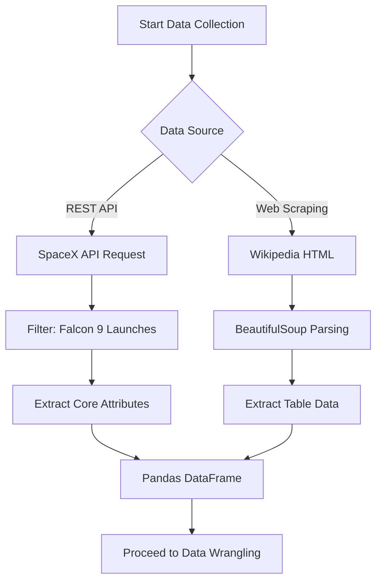

## Data Collection – SpaceX API
-   **Process**: We used the SpaceX REST API (`https://api.spacexdata.com/v4/launches/past`) to retrieve historical launch data.
-   **Details**: Requests were filtered for Falcon 9 launches. We extracted core attributes including Booster Version, Payload Mass, Orbit, Launch Site, and Landing Outcome.
-   The JSON responses were parsed and normalized into a Pandas DataFrame.

-   **Notebook**: [SpaceX API Data Collection](./jupyter-labs-spacex-data-collection-api.ipynb)

    **SpaceX API Data Collection Flow**:
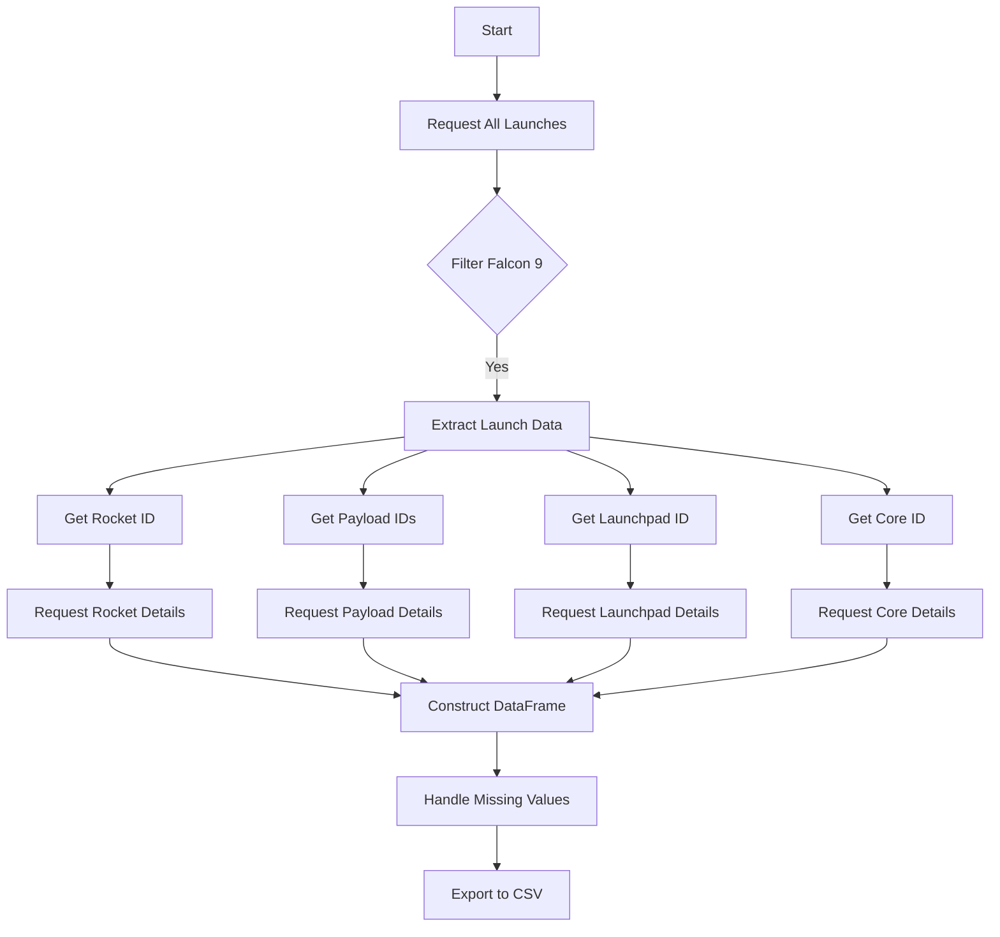

## Data Collection - Scraping
-   **Process**: We utilized **BeautifulSoup** to scrape additional Falcon 9 launch records from Wikipedia.
-   **Details**: Static HTML tables were parsed to extract data such as Flight No, Date, Time, Version Booster, Launch Site, Payload, and Mission Outcome.
-   This data was used to cross-reference and supplement the API dataset.

-   **Notebook**: [Web Scraping Data Collection](./jupyter_labs_webscraping_(1).ipynb)

-   **Web Scraping Process Flow**:
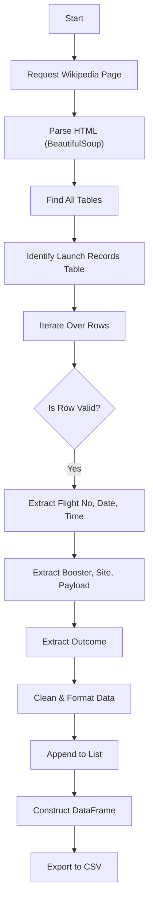

## Data Wrangling
-   **Filtering**: We filtered the dataset to include only Falcon 9 launches.
-   **Missing Values**: Missing values in the `PayloadMass` column were replaced with the mean payload mass.
-   **Outcome Classification**: We created a binary `Class` column:
    -   **1 (Success)**: Outcomes like 'True Ocean', 'True RTLS', 'True ASDS'.
    -   **0 (Failure)**: Outcomes like 'False Ocean', 'False RTLS', 'False ASDS', 'None ASDS', 'None None'.

-   **Notebook**: [Data Wrangling](./labs-jupyter-spacex-Data%20wrangling.ipynb)

-   **Wrangling Process Flow**:
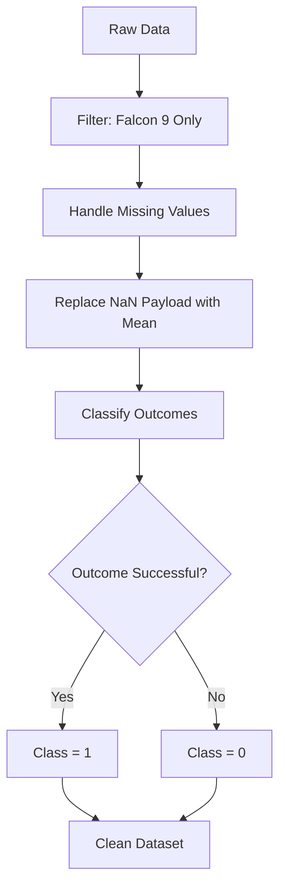

## EDA with Data Visualization
- Perform exploratory data analysis (EDA) using visualization and SQL
- Perform interactive visual analytics using Folium and Plotly Dash
-   **Notebooks**:
    -   [EDA with Visualization](./jupyter-labs-eda-dataviz-v2.ipynb)
    -   **GitHub Link**: [View on GitHub](https://github.com/Shiverion/IBM-Applied-Data-Science-Capstone/blob/master/jupyter-labs-eda-dataviz-v2.ipynb)

-   **Visualization Summary**:
    -   **Scatter Plot (Flight Number vs. Launch Site)**: To observe if specific launch sites were favored at different stages of SpaceX's history.
    -   **Scatter Plot (Payload Mass vs. Launch Site)**: To determine if certain launch sites are specialized for heavier or lighter payloads.
    -   **Bar Chart (Success Rate vs. Orbit)**: To identify which orbits have the highest success rates and which are technically more challenging.
    -   **Scatter Plot (Flight Number vs. Orbit)**: To visualize the sequence of orbit deployments over time.
    -   **Scatter Plot (Payload Mass vs. Orbit)**: To understand the payload capacity distribution across different orbits.
    -   **Line Chart (Yearly Success Trend)**: To track the overall reliability and improvement of Falcon 9 landings over the years.

## EDA with SQL
-   **Key Queries**:
    -   Calculated total payload mass carried by NASA boosters.
    -   Identified average payload mass for booster version F9 v1.1.
    -   Determined success rates for different landing outcomes.
    -   Ranked count of landing outcomes between specific dates.
-   **Notebook**: [EDA with SQL](./jupyter-labs-eda-sql-coursera_sqllite.ipynb)

## Build an Interactive Map with Folium
-   **Map Objects**: Created markers for each launch site (CCAFS SLC-40, KSC LC-39A, VAFB SLC-4E).
-   **Color Coding**: Used green markers for successful landings and red markers for failed landings.
-   **Proximities**: Added circles and lines to visualize distances from launch sites to nearest coastlines, railways, and highways, assessing safety zones.
-   **Notebook**: [Launch Site Location (Folium)](./lab-jupyter-launch-site-location-v2.ipynb)

# Build an Interactive Dashboard with Plotly Dash
-   **Components**: Included a Dropdown menu for selecting Launch Sites and a Range Slider for Payload Mass (0kg - 10,000kg).
-   **Visualizations**:
    -   **Pie Chart**: Shows the percentage of successful launches for all sites or a specific site.
    -   **Scatter Plot**: Displays correlation between Payload Mass and Launch Outcome (Success/Failure) for selected sites.
-   **Reference**: [Plotly Dash Instructions/Output](./Plotly_dash_task.pdf)
-   **App Script**: [SpaceX Dash App](./spacex_dash_app.py)

# Predictive Analysis (Classification)
-   **Process**:
    -   Standardized the dataset.
    -   Split data into **Training (80%)** and **Testing (20%)** sets.
    -   Used **GridSearchCV** with 10-fold cross-validation to tune hyperparameters.
-   **Models Built**: Logistic Regression, Support Vector Machine (SVM), Decision Tree, K-Nearest Neighbors (KNN).
-   **Best Model**: All models performed similarly with an accuracy of **~83.33%** on the test set. The Decision Tree model is often highlighted for its interpretability.

-   **Notebook**: [Machine Learning Prediction](./SpaceX-Machine-Learning-Prediction-Part-5-v1.ipynb)

-   **Prediction Methodology Flow**:
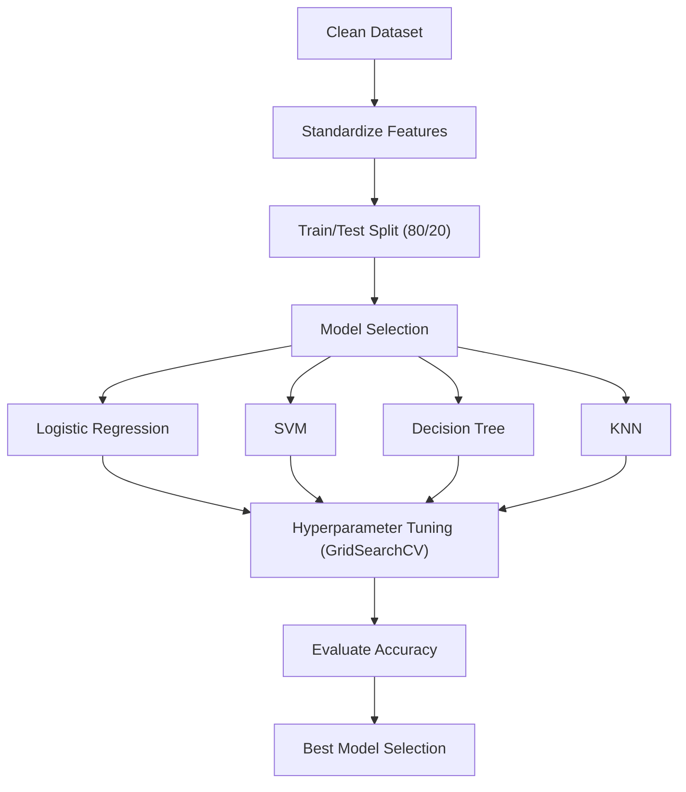

# Results
- Exploratory data analysis results
- Interactive analytics demo in screenshots
- Predictive analysis results


## Insight drawn from EDA
### Flight Number vs. Launch Site
-   **Insight**: As flight numbers increase (later years), success rates generally improve across all launch sites. CCAFS SLC-40 has the highest volume of launches.
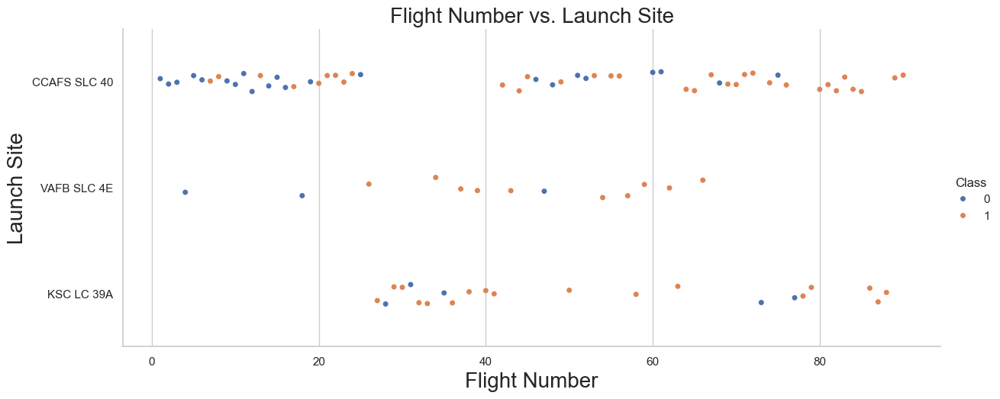

### Payload Mass vs. Launch Site
-   **Insight**: Launch sites like KSC LC-39A handle a wide range of payload masses with high success. VAFB SLC-4E deals with lighter payloads compared to CCAFS SLC-40.
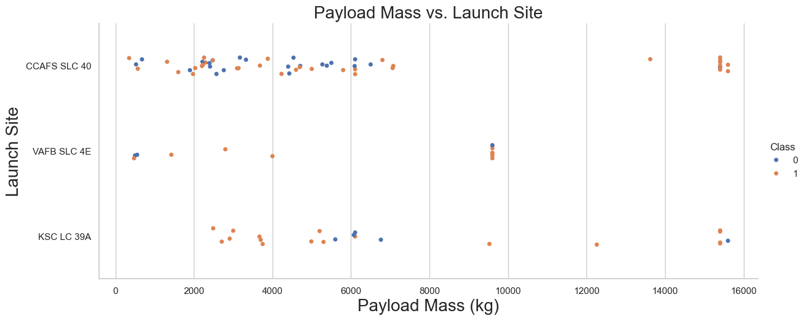

### Success Rate vs. Orbit Type
-   **Insight**: Orbits such as **ES-L1, GEO, HEO, and SSO** show a **100% success rate**. SO (Sun-Synchronous Orbit) has a lower success rate.
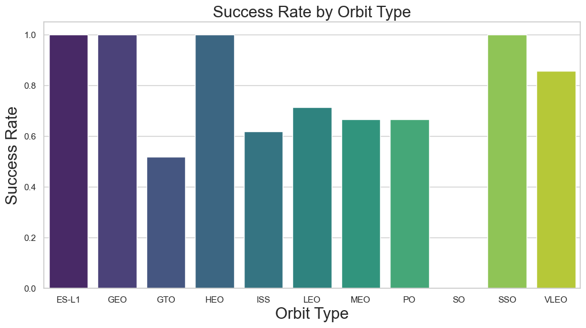

### Flight Number vs. Orbit Type
-   **Insight**: LEO (Low Earth Orbit) launches occur consistently throughout the dataset (all flight numbers). GTO launches are also frequent and spread out.
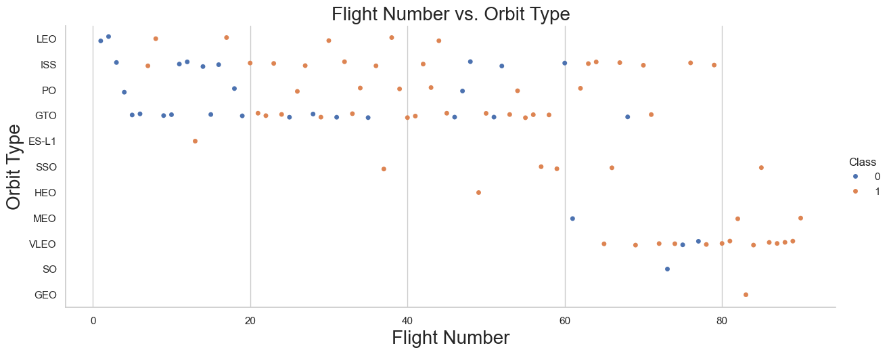

### Payload vs. Orbit Type
-   **Insight**: Heavy payloads are typically directed to LEO and ISS orbits. GTO orbits show a mix of payload masses.
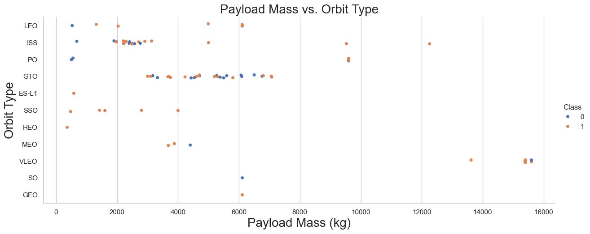

### Launch Success Yearly Trend
-   **Insight**: The success rate has steadily **increased** from 2013 to 2020, demonstrating SpaceX's learning curve and reliability improvements.
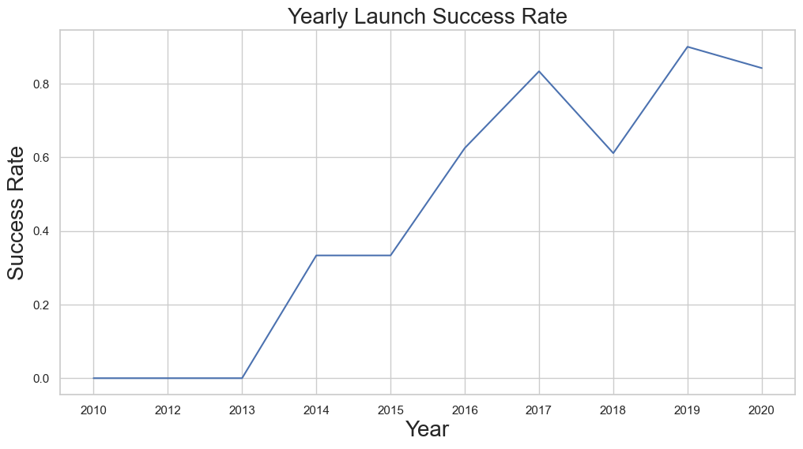

### All Launch Site Names
**Query**:
```sql
SELECT DISTINCT Launch_Site FROM SPACEXTABLE;
```
**Result**:
1. CCAFS LC-40
2. VAFB SLC-4E
3. KSC LC-39A
4. CCAFS SLC-40

**Explanation**: The query identifies 4 unique values for launch sites. It's important to note that **CCAFS LC-40** and **CCAFS SLC-40** refer to the same location (Cape Canaveral Space Launch Complex 40) but are recorded consistently in the dataset due to different naming conventions over time.


## Launch Sites Locations Analysis

### 1. Launch Site Locations
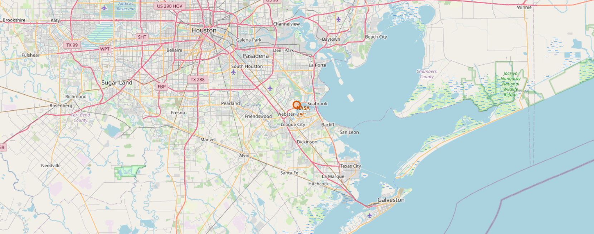
**Explanation**: The map above visualizes the geographical locations of all SpaceX launch sites.
-   **Key Finding 1**: All launch sites are located close to the **coast**. This safety measure ensures that in the event of a launch failure, debris falls into the ocean rather than populated areas.
-   **Key Finding 2**: The sites are positioned as close to the **Equator** as possible (within US territory) to maximize the boost received from Earth's rotation, reducing fuel consumption.

### 2. Launch Outcomes (Success/Failure)
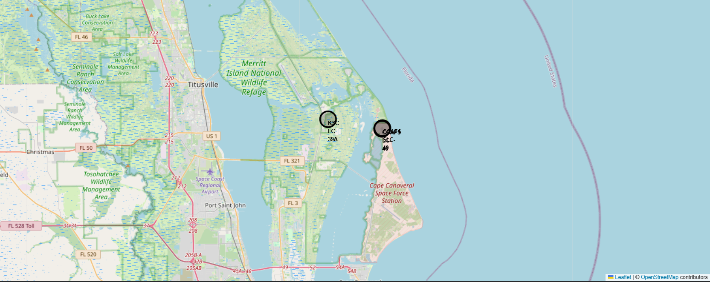
**Explanation**: This zoomed-in view shows the outcomes of individual launches using color-coded markers (Green = Success, Red = Failure).
-   **Key Finding**: **KSC LC-39A** and **VAFB SLC-4E** exhibit very high success rates with predominantly green markers. **CCAFS SLC-40**, being one of the busiest sites, shows a mix of successes and failures, reflecting the iterative learning process of early Falcon 9 launches.

### 3. Proximity to Key Infrastructures
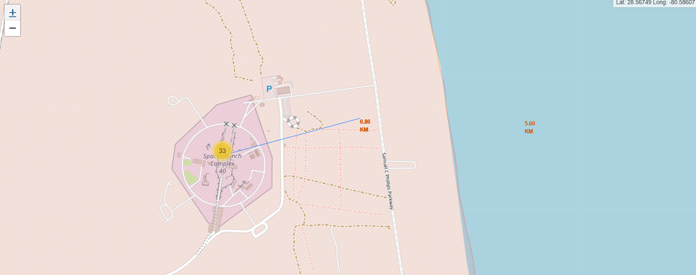
**Explanation**: This analysis highlights the distance between launch sites and critical infrastructure.
-   **Coastlines**: Launch sites are extremely close to the coast (< 1-2 km) for safety.
-   **Transport**: Sites are located near **railways** and **highways** to facilitate the transport of heavy rockets and payloads.
-   **Safety**: There is a safe buffer distance kept from **cities** and densely populated areas to minimize risk.


### Launch Site Names Begin with 'CCA'
-   **Query Result**: CCAFS SLC-40, CCAFS LC-40. All located at Cape Canaveral Air Force Station.

### Total Payload Mass
-   **Insight**: Sum of payload mass carried by NASA boosters is approx. 45,596 kg.

### Average Payload Mass by F9 v1.1
-   **Insight**: The average payload mass for version F9 v1.1 is approx. 2,928 kg.

### First Successful Ground Landing Date
-   **Date**: 2015-12-22.

### Successful Drone Ship Landing with Payload between 4000 and 6000
-   **Boosters**: B1022, B1026, B1021.2, B1031.2.

### Total Number of Successful and Failure Mission Outcomes
-   **Insight**: Success outcomes significantly outnumber failure outcomes.

### Boosters Carried Maximum Payload
-   **Insight**: Boosters like B1048, B1049, B1051 carried the max payload (approx 15,600 kg).

### 2015 Launch Records
-   **Insight**: In 2015, failed drone ship landings occurred at CCAFS SLC-40 with booster v1.1.

### Rank Landing Outcomes Between 2010-06-04 and 2017-03-20
-   **Insight**: 'No Attempt' was common in early years. 'Success (drone ship)' became the most frequent successful outcome in this period.


# Built a Dashboard with Plotly Dash

## 1. Launch Success Count for All Sites
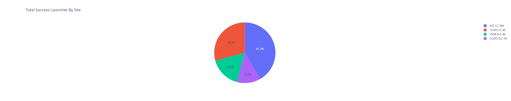
**Explanation**: The pie chart shows the proportion of successful launches contributed by each launch site. **KSC LC-39A** contributes the highest percentage of successful launches, followed by CCAFS SLC-40.

## 2. Launch Success Ratio for KSC LC-39A
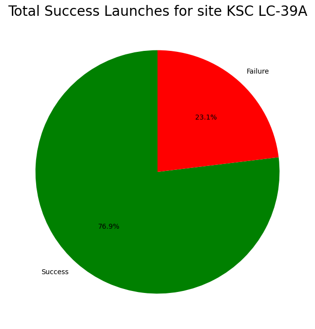
**Explanation**: This pie chart represents the success vs. failure ratio for **KSC LC-39A**. It has a very high success rate (approx 76.9%), making it one of the most reliable sites.

## 3. Payload vs. Launch Outcome (All Sites)
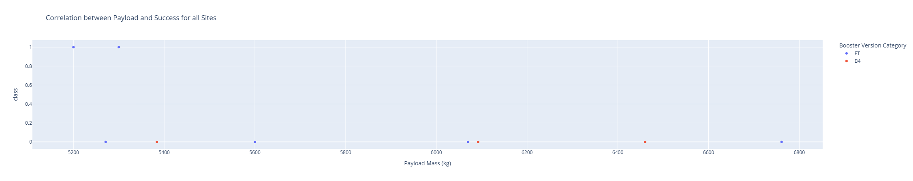
**Explanation**: The scatter plot visualizes the correlation between Payload Mass and Launch Outcome.
-   **Observations**:
    -   High payload masses (> 5000 kg) generally have higher success rates.
    -   **KSC LC-39A** (Green) and **VAFB SLC-4E** (Red) show strong performance across various payload ranges.
    -   Heavier payloads are largely successful, indicating the reliability of the Falcon 9 for heavy lift missions.


# Predictive Analysis (Classification)
## Classification Accuracy

-   **Logistic Regression**: 84.6% (Train), 83.3% (Test)
-   **SVM**: 84.8% (Train), 83.3% (Test)
-   **Decision Tree**: 88.9% (Train), 83.3% (Test)
-   **KNN**: 84.8% (Train), 83.3% (Test)
-   **Conclusion**: The Decision Tree model had the highest training accuracy, but all models generalized equally well to the test data with **83.33% accuracy**.

## Confusion Matrix (Decision Tree)
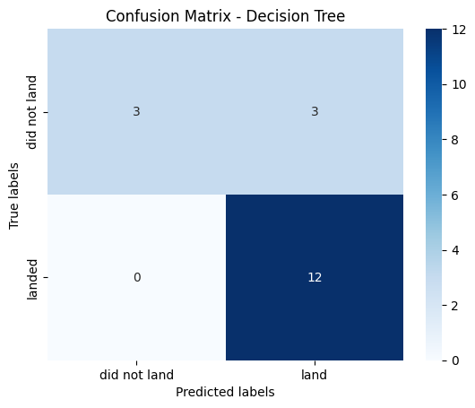

The Decision Tree model achieved an accuracy of **83.33%** on the test set. The confusion matrix reveals:
-   **True Positives (12)**: Correctly predicted successful landings.
-   **True Negatives (3)**: Correctly predicted failed landings.
-   **False Positives (3)**: Incorrectly predicted successful landings (Type I Error).
-   **False Negatives (0)**: No failed landings were missed (Type II Error).

The model demonstrates a strong ability to identify successful landings but shows a slight tendency to be optimistic, occasionally classifying failures as successes.

## Conclusions
-   **Reusability is Key**: Successful landings of the first stage are becoming routine, driving down launch costs.
-   **Location Matters**: Launch sites like KSC LC-39A have higher success rates, likely due to newer infrastructure and mission profiles.
-   **Model Reliability**: Machine Learning models can predict landing outcomes with reasonably high accuracy (~83%), providing actionable insights for mission planning.
-   **Continuous Improvement**: The clear upward trend in success rates demonstrates SpaceX's rapid iteration and technological advancement.

# Appendix

## SQL Queries
Here are some key SQL queries used during the exploratory data analysis:

**1. Calculate Total Payload Mass for NASA (CRS)**
```sql
SELECT SUM(PAYLOAD_MASS__KG_) FROM SPACEXTABLE WHERE Customer = 'NASA (CRS)';
```

**2. Find Boosters with Maximum Payload Mass**
```sql
SELECT Booster_Version FROM SPACEXTABLE WHERE PAYLOAD_MASS__KG_ = (SELECT MAX(PAYLOAD_MASS__KG_) FROM SPACEXTABLE);
```

**3. Rank Landing Outcomes (2010-2017)**
```sql
SELECT Landing_Outcome, COUNT(*) AS Count FROM SPACEXTABLE
WHERE Date BETWEEN '2010-06-04' AND '2017-03-20'
GROUP BY Landing_Outcome
ORDER BY Count DESC;
```

## Python Scripts
Below are custom scripts created for the dashboard and visualization tasks:

- **[spacex_dash_app.py](./spacex_dash_app.py)**: The source code for the Plotly Dash interactive dashboard.
- **[visualize_confusion_matrix.py](./visualize_confusion_matrix.py)**: Script used to reproduce the Decision Tree model training and generate the confusion matrix visualization.
